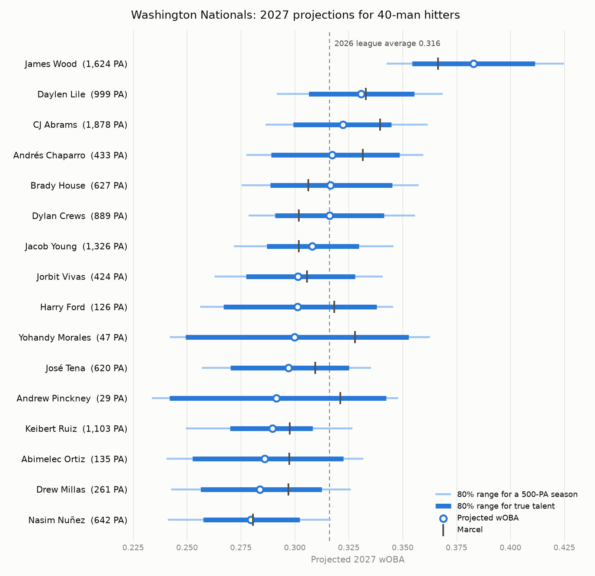

# Statcast Projections

## Overview:

After building a Bayesian projection model for our softball hitters, I wanted to see how the same approach held up on major league data, where there is enough of it to test a projection properly. This project projects a hitter's next-season wOBA from three seasons of public Statcast data with a hierarchical Bayesian model in PyMC, gives an 80% range with every projection, and tests it over three holdout seasons against Marcel.

Over 2024 to 2026 and 1,235 hitter-seasons, the model was as accurate as Marcel but not more accurate, with an RMSE of .0337 compared to .0338. Where it does better is in ordering hitters, in bias, and in giving ranges that held 79% of actual results against a target of 80%.

The full write-up is in [reports/model_card.md](reports/model_card.md), and the 2027 projections for Washington's 40-man hitters are in [reports/nationals_2027.md](reports/nationals_2027.md).



## How It Works:

The first step is downloading six seasons of Statcast pitch data from Baseball Savant, from 2021 to 2026, and keeping only the pitch that ended each plate appearance, which leaves about 1.1 million rows in PostgreSQL. Every hitter-season is then checked so that PA = K + BB + HBP + balls in play, and 120 random hitter-seasons were compared with Savant's published leaderboard, where plate appearances matched exactly.

The model treats a plate appearance as a sequence, where the hitter either strikes out, walks, gets hit by a pitch, or puts the ball in play, which is worth his contact quality. Each skill has a level for every hitter, a yearly drift whose size is learned from the data, and an age curve shared by everyone. To test it, I predicted 2024, 2025, and 2026 each from the three seasons before, and scored it against Marcel, last season's wOBA, and league average. The final fit uses 2024 to 2026 to project 2027 for the current Nationals roster.

## Running It:

This needs Python 3.11 or newer and a PostgreSQL database and role the code can use (see `src/sample/db.py`). The password is read from `pgpass.conf`.

```
py -3.13 -m venv .venv
.venv\Scripts\python.exe -m pip install -r requirements.txt
.venv\Scripts\python.exe -m pip install -e .
```

| Command | What it does | Time |
|---|---|---|
| `python -m sample download` | Downloads the Statcast data, and can pick up where it left off | About an hour |
| `python -m sample build` | Builds season totals and runs the validation checks | |
| `python -m sample evaluate` | Runs the holdout test | About 15 minutes |
| `python -m sample project` | Fits on 2024 to 2026 and makes the 2027 table | About 7 minutes |
| `python -m pytest` | Runs the 17 tests | |

## Layout:

```
sql/                 table definitions (mlb schema)
src/sample/
  download.py        Statcast download, one row per plate appearance
  aggregate.py       season totals, league numbers, validation
  marcel.py          Marcel and the other baselines
  model.py           the PyMC model, projection, simulated hitters
  evaluate.py        holdout test and scoring
  project.py         roster and the 2027 table
tests/               Marcel by hand, parsing, model recovery, scoring
reports/             model card, projection table, charts, saved results
```
