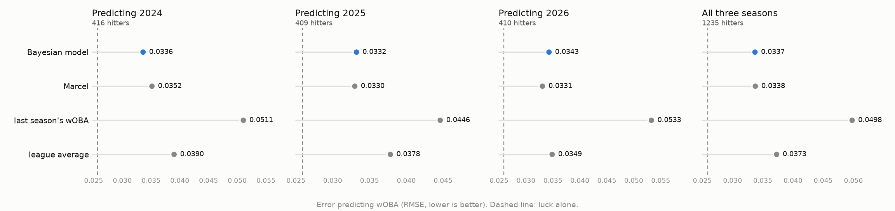

# Model card: Bayesian wOBA projections from Statcast

**What it is.** A hierarchical Bayesian model in PyMC that projects a hitter's
next-season wOBA from three seasons of public Statcast data, with an 80% range.
Fitted here on 2024-2026 to project 2027 for the hitters on Washington's 40-man
roster.

**What it found.** Over three holdout seasons the model is as accurate as
Marcel, not more: RMSE .0337 against .0338. It ranks hitters better, is less
biased, and its 80% ranges contain 79% of actual results, which Marcel has no
way to offer.



## Data

| | |
|---|---|
| Source | Baseball Savant Statcast search, regular season, 2021 to 2026 |
| Downloaded | 4.28 million pitches in 316 date ranges |
| Kept | 1,098,964 rows: the pitch that ended each plate appearance |
| Hitters | Non-pitchers only (404 pitchers removed by primary position; two-way players kept) |
| Hitter-seasons | 3,964 |
| Storage | PostgreSQL, `mlb` schema |

A plate appearance is a row Statcast counts in the wOBA denominator, which
leaves out intentional walks and sacrifice bunts. Two corrections are applied
to Statcast's per-pitch `woba_value`: it credits reaching on an error or a
fielder's choice as a single, and standard wOBA gives those nothing; and
catcher's interference is not counted as a plate appearance.

**Validation.** PA = K + BB + HBP + balls in play holds for every hitter-season.
Twenty random hitters per season (120 in all) were compared with Baseball
Savant's published expected-statistics leaderboard: plate appearances match
exactly for all 120; expected wOBA is within .005; wOBA is within .008. The
wOBA gap is expected, because the pitch data carries rounded run values (0.7,
0.9, 1.25, 1.6, 2.0) and the leaderboard uses each season's exact ones.

## Method

A plate appearance is a sequence: strikeout; if not, walk; if not, hit by
pitch; if not, a ball in play worth the hitter's contact quality. Contact
quality is Statcast's published expected wOBA per batted ball. For strikeout,
walk and contact skill, hitter *i* in season *t*:

```
skill[i, t] = level[i] + aging[i, t] + drift[i, t] + season[t]

level[i]    ~ Normal(mu + age_curve(age in first season), sigma)
aging[i, t] = age_curve(age[i, t]) - age_curve(age in first season)
drift[i, t] = drift[i, t-1] + Normal(0, tau)
age_curve   = b1 * a + b2 * a^2,    a = (age - 28) / 5
season[t]   = league shift that season, from the data

strikeouts  ~ Binomial(PA, logit^-1(skill_k))
walks       ~ Binomial(PA - K, logit^-1(skill_bb))
sum of expected wOBA on contact ~ Gamma(n * alpha, alpha / exp(skill_c))
```

Hit-by-pitch has a per-hitter talent with no drift or age curve. The projection
carries each hitter's drift one more year, adds a year of age, and reassembles
wOBA. `sigma` (how much hitters differ) sets how far a small sample is pulled
toward the league. `tau` (how much one hitter changes in a year) sets how much
the latest season counts against earlier ones. Marcel fixes both by hand, at
1,200 PA of regression and 5/4/3 weights; here both are estimated, with
uncertainty, separately for each skill.

Sampling: NUTS, 4 chains, 2,000 warm-up and 4,000 kept draws each, about 5
minutes per fit for roughly 900 hitters.

**What the model learned (2024-2026 fit, 80% ranges):**

| | Strikeout | Walk | Contact |
|---|---|---|---|
| Spread between hitters (`sigma`) | .348 (.334 to .361) | .332 (.317 to .349) | .117 (.112 to .123) |
| Yearly change in one hitter (`tau`) | .127 (.116 to .138) | .156 (.141 to .172) | .036 (.029 to .044) |

Strikeout and walk are on the log-odds scale, contact on the log scale.
Relative to the spread between hitters, walk rate moves the most from year to
year and contact quality the least.

## Fit quality

| Fit | Hitters | Divergences | Largest r-hat | Smallest effective sample |
|---|---|---|---|---|
| Train 2021-23, predict 2024 | 941 | 0 | **1.017** | 573 |
| Train 2022-24, predict 2025 | 924 | 0 | 1.003 | 680 |
| Train 2023-25, predict 2026 | 897 | 0 | 1.005 | 1,136 |
| Train 2024-26, project 2027 | 894 | 0 | 1.005 | 1,054 |

Three of four fits meet the usual r-hat threshold of 1.01. The 2021-23 fit does
not: its contact-skill `tau` mixes slowly, because in that window the yearly
change in contact is small and hard to separate from ball-to-ball noise. An
earlier, shorter run of the same fit gave the same holdout RMSE (.0336), so the
scores below do not appear sensitive to it, but that fit is not clean and is
reported as such.

**Recovery on simulated data.** On simulated hitters with known talent paths,
playing time tied to talent, the projection is closer to true talent than
Marcel (RMSE .027 against .042 with 400 hitters). That test is generated from
the model's own assumptions, so it shows the code is right, not that the model
is right about baseball.

## Holdout results

Each target season is predicted from the three before it. The model, Marcel and
the other baselines see the same three seasons. Scored on hitters with 100 or
more PA in the target season and any MLB history in the window, weighted by PA.

| Target | Hitters | Model RMSE | Marcel RMSE | Model's gain (80% range) | Model better in | Model's 80% coverage |
|---|---|---|---|---|---|---|
| 2024 | 416 | **.0336** | .0352 | +.0015 (+.0005 to +.0026) | 97% of resamples | 77% |
| 2025 | 409 | .0332 | **.0330** | −.0002 (−.0013 to +.0009) | 40% | 80% |
| 2026 | 410 | .0343 | **.0331** | −.0012 (−.0023 to −.0001) | 9% | 80% |
| **All** | 1,235 | **.0337** | .0338 | +.0001 (−.0006 to +.0007) | 55% | 79% |

Pooled over the three seasons:

| Method | RMSE | MAE | Bias | Rank correlation |
|---|---|---|---|---|
| Bayesian model | .0337 | .0264 | +.0016 | .41 |
| Marcel | .0338 | .0263 | +.0061 | .36 |
| League average | .0373 | .0290 | −.0016 | none |
| Last season's wOBA | .0498 | .0358 | +.0005 | .31 |
| *Luck alone, talent known exactly* | *.0259* | | | |

Reading it:

- **Against Marcel it is a tie.** The model wins 2024 clearly, loses 2026
  clearly, and 2025 is a toss-up. Pooled, the difference is .0001.
- **It beats league average and last season's wOBA** in essentially every resample.
- **It orders hitters better** (rank correlation .41 against .36) and is **less
  biased** (+.0016 against +.0061; Marcel ran high in all three seasons).
- **Its ranges are calibrated.** 77%, 80% and 80% of actual results fell inside
  the 80% range for the plate appearances each hitter actually got.
- **Most of the error is luck.** A forecaster who knew every hitter's true
  talent would still score .0259. The model and Marcel are both about .008
  above that floor.

## Output: Washington's 40-man hitters, 2027


Roster pulled from MLB's public feed on 2026-10-05: 45 players, 16 non-pitchers.
All 16 have MLB plate appearances in 2024-2026. Full table with strikeout rate,
walk rate and contact quality: [nationals_2027.md](nationals_2027.md).

| Hitter | Age | MLB PA 2024-26 | 2026 wOBA | Projected | Talent range | 500-PA range | Marcel |
|---|---|---|---|---|---|---|---|
| James Wood | 24 | 1,624 | .381 | **.383** | .354 to .411 | .343 to .425 | .366 |
| Daylen Lile | 24 | 999 | .312 | **.331** | .306 to .355 | .292 to .369 | .333 |
| CJ Abrams | 26 | 1,878 | .356 | **.322** | .299 to .345 | .286 to .362 | .339 |
| Andrés Chaparro | 28 | 433 | .380 | **.317** | .289 to .349 | .278 to .360 | .331 |
| Brady House | 24 | 627 | .313 | **.317** | .289 to .345 | .275 to .357 | .306 |
| Dylan Crews | 25 | 889 | .292 | **.316** | .291 to .341 | .279 to .356 | .302 |
| Jacob Young | 27 | 1,326 | .315 | **.308** | .287 to .330 | .272 to .346 | .302 |
| Jorbit Vivas | 26 | 424 | .298 | **.301** | .277 to .328 | .263 to .341 | .306 |
| Harry Ford | 24 | 126 | .300 | **.301** | .267 to .338 | .256 to .346 | .318 |
| Yohandy Morales | 25 | 47 | .353 | **.300** | .249 to .353 | .242 to .363 | .328 |
| José Tena | 26 | 620 | .298 | **.297** | .270 to .325 | .257 to .335 | .309 |
| Andrew Pinckney | 26 | 29 | .328 | **.291** | .242 to .342 | .234 to .348 | .321 |
| Keibert Ruiz | 28 | 1,103 | .328 | **.290** | .270 to .308 | .250 to .327 | .298 |
| Abimelec Ortiz | 25 | 135 | .245 | **.286** | .253 to .323 | .240 to .332 | .297 |
| Drew Millas | 29 | 261 | .254 | **.284** | .256 to .312 | .243 to .326 | .297 |
| Nasim Nuñez | 26 | 642 | .251 | **.280** | .258 to .302 | .241 to .317 | .281 |

"Talent range" is the 80% interval for true talent. "500-PA range" is the 80%
interval for the wOBA he would post over a 500-PA season, wider because a
season carries its own luck. The 2026 league average is .316.

Where the model and Marcel differ most, and why:

- **Small samples.** For Pinckney (29 PA), Morales (47) and Ford (126) the model
  is 17 to 30 points lower. Marcel regresses everyone to the PA-weighted league
  average, which is set by regulars. The model regresses to the average
  *hitter* of that age, and the many hitters with little playing time are
  below the regulars. Their talent ranges are also about 100 points wide.
- **Results ahead of contact.** For Abrams and Chaparro the model is 14 to 17
  points lower, because their 2026 results outran their expected wOBA on
  contact, which is what the model projects from.
- **Contact ahead of results.** For Wood, Crews and House it is 11 to 17 points
  higher, for the opposite reason.

## Limitations

- **It does not beat Marcel.** Three seasons of season-level counts are roughly
  what Marcel already uses well. The model's case rests on calibrated ranges,
  better ordering and a structure that can take more information.
- **Contact quality is Statcast's expected wOBA.** The model inherits its
  assumptions. A hitter who consistently beats or trails his expected wOBA
  (speed, spray, pull-side power) is mis-projected, and nothing here corrects it.
- **No park, opponent or platoon adjustment.**
- **No minor-league data.** A prospect with no MLB plate appearances would get
  only the league-level projection for his age. Triple-A Statcast with a level
  adjustment is the obvious next step, and where a hierarchical model should
  gain the most on Marcel.
- **Skills are modelled as independent** and the age curve is a single quadratic
  shared by all hitters.
- **Next season's league level is taken as the last season's.**
- **Playing time is not projected.** The season range assumes 500 PA.
- **Rounded run values.** wOBA here uses Statcast's rounded weights, so it runs
  about .002 to .003 above published wOBA.
- **One fit of four is not clean** (r-hat 1.017), as described above.

## Reproducing it

```
python -m sample download     # about an hour, resumable
python -m sample build        # season totals and every validation check
python -m sample evaluate     # three holdout seasons, about 15 minutes
python -m sample project      # 2027 fit and the roster table, about 7 minutes
python -m pytest              # 17 tests
```
